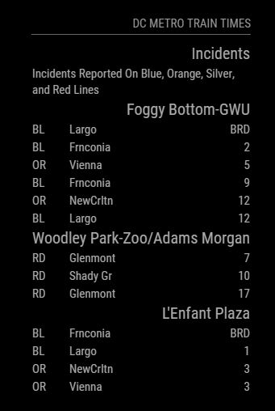
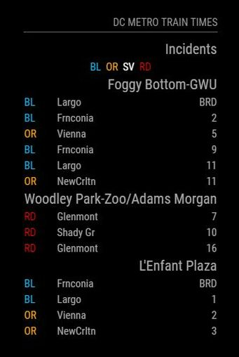

# Module: DC Metro Train Times
The `MMM-DCMetroTrainTimes` module is a module designed to display the train arrival times as stations along the Washington Metropolitan Area Transit Authority metro system, aka the Washington DC metro system. It is configurable based on the stations to get arrival times for, destinations to exclude, coloring line codes visually, and other options.

It also will show any incidents reported by WMATA on the rail lines by listing which color lines are currently affected, i.e. Orange, Blue, Silver, etc.

Example:

 

## Dependencies / Requirements

This module requires access to a WMATA Developers API key. For more information on acquiring thisplease visit <https://developer.wmata.com/>.

You will also need to configure the metro stations of interest to you by using the station code which are listed in the seperate [./stationcodes/stationcodes.md](./stationcodes/stationcodes.md).

NOTE: The [./stationcodes/stationcodes.json](./stationcodes/stationcodes.json) file is actually used by the module so calls are not made to get it each time the module runs since the station codes and other information are rarely changed. If a problem occurs involving the codes you can run the [./stationcodes/getStationCodes.js](./stationcodes/getStationCodes.js) to update them.

## Using the module

To use this module, add it to the modules array in the `config/config.js` file:
````javascript
modules: [
	{
		module: 'MMM-DCMetroTrainTimes',
		position: 'bottom_right',
		config: {
		// visit the url below for the wmata api key
		// https://developer.wmata.com/
			wmata_api_key: 'FILL IN',
		// use the station codes file ./stationcodes/stationcodes.md for
		// more on these values
			stationsToShowList: [ 'C04', 'A04', 'D03' ],
		}
	}	
]
````

## Configuration options

The following properties can be configured:

<table width="100%">
	<!-- why, markdown... -->
	<thead>
		<tr>
			<th>Option</th>
			<th width="100%">Description</th>
		</tr>
	<thead>
	<tbody>
		<tr>
			<td><code>wmata_api_key</code></td>
			<td>Used by the module to make calls to the WMATA JSON REST API. For more visit <a href="https://developer.wmata.com/">https://developer.wmata.com/</a>.<br>
			<br>This value is <b>REQUIRED</b>
			</td>
		</tr>
		<tr>
			<td><code>stationsToShowList</code></td>
			<td>Contains a JSON array of strings indicating WMATA Metro Station Code values. These are the stations you want to see train arrival times for. A table of these values can be found at <a href="./stationcodes/stationcodes.md">./stationcodes/stationcodes.md</a>.<br>
			<br><b>Example:</b> <code>[ 'C04', 'A04', 'D03' ]</code>
			<br>This value is <b>OPTIONAL, BUT EFFECTIVELY REQUIRED</b>
			<br><b>Default value:</b> <code>[ 'A01', 'C01' ]</code>	
			</td>
		</tr>	
		<tr>
			<td><code>showIncidents</code></td>
			<td>Toggle to turn on or off the incidents listing which will be shown before the train arrival times. Default is on.<br>
				<br><b>Example:</b> <code>false</code>
				<br><b>Default value:</b> <code>true</code>
				<br>This value is <b>OPTIONAL</b>
			</td>
		</tr>
		<tr>
			<td><code>showStationTrainTimes</code></td>
			<td>Toggle to turn on or off the station train arrival times listing which is shown after the incidents listing. Default is on.<br>
				<br><b>Example:</b> <code>false</code>
				<br><b>Default value:</b> <code>true</code>
				<br>This value is <b>OPTIONAL</b>
			</td>
		</tr>		
		<tr>
			<td><code>destinationsToExcludeList</code></td>
			<td>Contains a JSON array of strings indicating WMATA Metro Station Code values. The station codes listed here will be hidden from any list of train arrivals for any of the stationsToShowList. This is useful if you live near the end of a line and aren't interested in taking trains towards your end. If left empty no destination stations will be excluded.<br>
				<br><b>Example:</b> <code>[ 'N06', 'D13' ]</code>
				<br><b>Default value:</b> <code>[ ]</code>
				<br>This value is <b>OPTIONAL</b>
			</td>
		</tr>
		<tr>
			<td><code>showDestinationFullName</code></td>
			<td>Toggle to turn on or off full destination station names. Otherwise it will be an abbreviated destination station name.  Default is on (full station name).<br>
				<br><b>Example:</b> <code>false</code>
				<br><b>Default value:</b> <code>true</code>
				<br>This value is <b>OPTIONAL</b>
			</td>
		</tr>
		<tr>		
			<td><code>refreshRateIncidents</code></td>
			<td>Specified in <b>MILLISECONDS</b>, sets the rate at which updates will be made to the metro incidents list. This value defaults to every two minutes. Note setting this value to low, i.e. fast, can use up a lot of alloted daily API calls so don't abuse this value. Also, incidents aren't updated nearly as often as train arrival times.<br>
				<br><b>Example:</b> <code>6 * 60 * 1000</code>
				<br><b>Default value:</b> <code>2 * 60 * 1000</code>
				<br>This value is <b>OPTIONAL</b>
			</td>
		</tr>
		<tr>
			<td><code>refreshRateStationTrainTimes</code></td>
			<td>Specified in <b>MILLISECONDS</b>, sets the rate at which updates will be made to the station train arrival times list. This value defaults to every thirty seconds. Note setting this value to low, i.e. fast, can use up a lot of alloted daily API calls so don't abuse this value.<br>
				<br><b>Example:</b> <code>1 * 60 * 1000</code>
				<br><b>Default value:</b> <code>30 * 1000</code>
				<br>This value is <b>OPTIONAL</b>
			</td>
		</tr>	
		<tr>
			<td><code>maxTrainTimesPerStation</code></td>
			<td>The maximum number of train times to show per station, i.e. if you set this to 2 you would only ever get the 2 next train times for a given station. This defaults to zero which means show all the train times.<br>
				<br><b>Example:</b> <code>3</code>
				<br><b>Default value:</b> <code>0</code>
				<br>This value is <b>OPTIONAL</b>
			</td>
		</tr>	
		<tr>
			<td><code>showHeader</code></td>
			<td>Toggles the header title on or off.<br>
				<br><b>Example:</b> <code>false</code>
				<br><b>Default value:</b> <code>true</code>
				<br>This value is <b>OPTIONAL</b>
			</td>
		</tr>
		<tr>
			<td><code>headerText</code></td>
			<td>The text to display in the header title.<br>
				<br><b>Example:</b> <code>"WMATA Train Arrival Times"</code>
				<br><b>Default value:</b> <code>"DC Metro Train Times"</code>
				<br>This value is <b>OPTIONAL</b>
			</td>
		</tr>				
		<tr>
			<td><code>limitWidth</code></td>
			<td>The width of cell containing the incident list, usually the widest cell. It effectively limits the total width of this module. Usually specified in pixels but can specified in any HTML width style. Specified as a string.<br>
				<br><b>Example:</b> <code>"350px"</code>
				<br><b>Default value:</b> <code>"200px"</code>
				<br>This value is <b>OPTIONAL</b>
			</td>
		</tr>
		<tr>
			<td><code>colorizeLines</code></td>
			<td>Toggle this to enable colorzing any train line code or name by it's color, i.e. the Orange Line 'OR' will be colored orange, the Blue Line 'BL' will be colored blue, etc. Defaults to off to fit with the usual Magic Mirror look.<br>
				<br><b>Example:</b> <code>true</code>
				<br><b>Default value:</b> <code>false</code>
				<br>This value is <b>OPTIONAL</b>
			</td>
		</tr>
		<tr>
			<td><code>incidentCodesOnly</code></td>
			<td>Toggle to change from the full text of the lines with incidents to just showing line codes, i.e. "Incident Reported On The Orange Line" as opposed to just showing "OR". Turned off by default to do a full-text listing of lines with incidents on them.<br>
				<br><b>Example:</b> <code>true</code>
				<br><b>Default value:</b> <code>false</code>
				<br>This value is <b>OPTIONAL</b>
			</td>
		</tr>		
		<tr>
			<td><code>hideTrainTimesLessThan</code></td>
			<td>Will exclude listing trains that are arriving in time less the specified amount in <b>MINUTES</b>. This is useful if for instance it took your four minutes to walk to your station so showing trains arriving less than four minutes would be useful. Note that is processed before maxTrainTimesPerStation. This defaults to zero which disables it.<br>
				<br><b>Example:</b> <code>4</code>
				<br><b>Default value:</b> <code>0</code>
				<br>This value is <b>OPTIONAL</b>
			</td>
		</tr>			
	</tbody>
</table>
